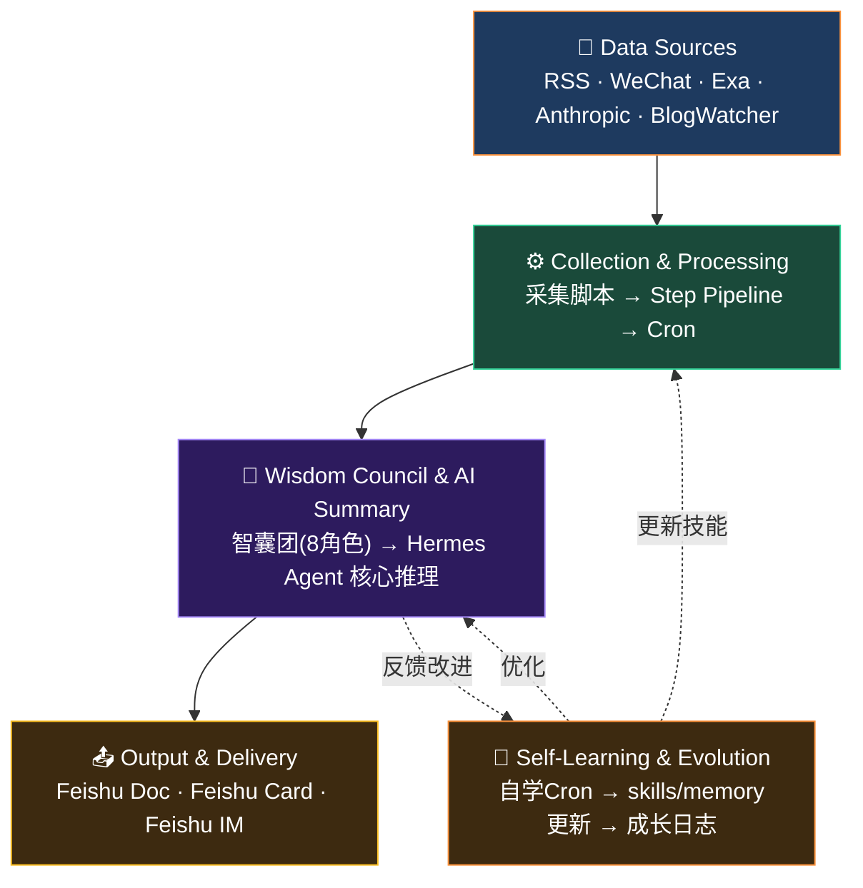
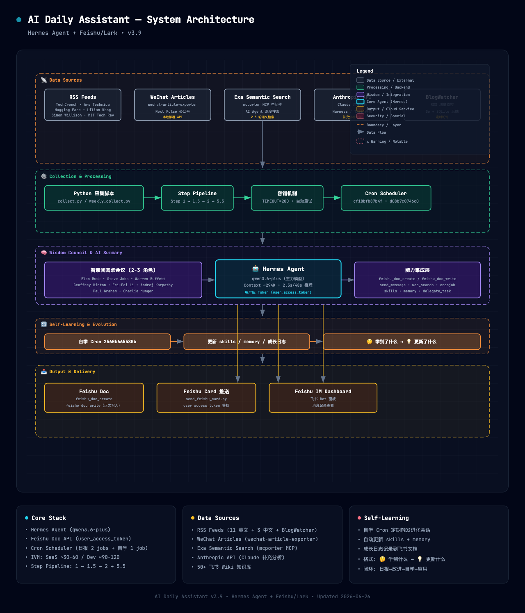

# AI Daily Assistant — System Architecture

> Hermes Agent + Feishu/Lark • v3.9 • Updated 2026-06-26

---

## 系统概述

AI Daily Assistant 是基于 Hermes Agent 构建的智能日报系统，自动采集 AI/Agent 领域技术文章，经过 AI 筛选、智囊团多视角分析、标准化排版后，推送至飞书文档和卡片消息。

---

## 架构分层

| 📡 数据源层 | RSS / WeChat / Exa / Anthropic / 飞书 Wiki / BlogWatcher | 上游输入 |
| ⚙️ 采集处理层 | Python 采集脚本 → Step Pipeline → Cron 调度 | ETL 处理 |
| 🧠 智囊团 & AI 摘要 | 8 角色智囊团 + Hermes Agent (qwen3.6-plus) 核心推理 | 核心决策 |
| 🔄 自学习进化层 | 自学 Cron → 技能/memory 更新 → 成长日志记录 | 闭环进化 |
| 📤 输出交付层 | Feishu Doc / Feishu Card / Feishu IM Dashboard | 下游输出 |

---

### 架构分层概览



| 数据源 | 说明 | 技术栈 |
|--------|------|--------|
| RSS Feeds | TechCrunch, Ars Technica, Hugging Face, Lilian Weng, Simon Willison, MIT Tech Review 等 11+3 个源 | BlogWatcher (Go + SQLite) |
| WeChat Articles | Next Pulse 公众号文章采集 | wechat-article-exporter (本地部署 API) |
| Exa Semantic Search | AI Agent 深度语义检索 2-3 轮 | mcporter MCP 中间件 |
| Anthropic API | Claude 补充深度分析 | Anthropic API |
| 飞书 Wiki | 50+ 知识库文档 | Feishu Wiki API |

### ⚙️ 采集处理层 (Collection & Processing)

- **采集脚本**: `collect.py`, `daily_learning_weekly_collect.py`
- **Step Pipeline**: Step 1 → Step 1.5 → Step 2 → Step 5.5
- **容错机制**: TIMEOUT=200, 自动重试
- **定时调度**: Cron Scheduler (2 个 job)
  - 技术日报: `cf18bfb87b4f`
  - 学习日报: `d08b7c0746c0`

### 🧠 智囊团 & AI 摘要层 (Wisdom Council & AI Summary)

- **智囊团圆桌会议**: 2-3 角色多视角分析
  - Elon Musk · Steve Jobs · Warren Buffett · Charlie Munger
  - Geoffrey Hinton · Fei-Fei Li · Paul Graham · Andrej Karpathy
- **核心引擎**: 🤖 Hermes Agent
  - 主力模型: qwen3.6-plus (阿里云)
  - Context ~294K, 推理 ~2.5s/48s
  - 用户级 Token (user_access_token)
- **能力集成层**:
  - `feishu_doc_create` / `feishu_doc_write`
  - `send_message` · `web_search` · `cronjob`
  - `skills` · `memory` · `delegate_task`

### 🔄 自学习进化层 (Self-Learning & Evolution)

系统具备自主进化能力，通过定期的自学会话实现技能和知识的持续更新。

| 组件 | 说明 |
|------|------|
| **自学 Cron** (`2560b665580b`) | 定期触发自学会话，独立于日报流程运行 |
| **技能更新** | 发现更优方案后，自动更新 skills（`skill_manage patch`） |
| **记忆进化** | 将学到的知识持久化到 memory，跨会话复用 |
| **成长日志** | 学习成果记录到飞书文档（自学技能更新日志） |

**自学日志格式**:
```
🤔 学到了什么 — 核心理念/解决的问题
💡 更新了什么 — 具体的 skill/memory 变更
```

**闭环进化路径**:
```
日报执行 → 发现改进点 → 自学会话学习 → 更新 skills/memory → 后续日报应用改进
                      ↕
              成长日志记录到飞书
```

### 📤 输出交付层 (Output & Delivery)

| 通道 | 说明 | 技术实现 |
|------|------|----------|
| Feishu Doc | 日报文档创建与正文写入 | `feishu_doc_create` + `feishu_doc_write` |
| Feishu Card 推送 | 飞书卡片消息通知 | `send_feishu_card.py` (user_access_token) |
| Feishu IM Dashboard | 飞书 Bot 面板（消息记录查看） | 飞书 IM API |

---

## 核心特性

### 标准化排版 (2026-06-18)

**技术日报格式**:
```
🏆 今日精选
📌 其他值得关注
📈 今日趋势
🧠 智囊团圆桌会议
```

**学习日报格式**:
```
📊 采集概览 (bullet 统计)
📚 精选内容
1️⃣ 编号 · 评分:N · 摘要:
🧠 智囊团
```

### 数据流转

参见上方 [架构分层概览](#架构分层概览) 的 Mermaid 流程图。

### 开源项目

本系统核心依赖以下 GitHub 开源项目：

| 项目 | 仓库地址 | 用途 |
|------|----------|------|
| Hermes Agent | [github.com/nousresearch/hermes-agent](https://github.com/nousresearch/hermes-agent) | Agent 框架、工具调用、Cron 调度 |
| wechat-article-exporter | [github.com/qiye45/wechat-article-exporter](https://github.com/qiye45/wechat-article-exporter) | 微信公众号文章采集导出 |
| BlogWatcher CLI | [github.com/JulienTant/blogwatcher-cli](https://github.com/JulienTant/blogwatcher-cli) | RSS/博客增量监控（Go + SQLite） |
| Lark CLI | [github.com/larksuite/cli](https://github.com/larksuite/cli) | 飞书/Lark 官方命令行工具 |
| Architecture Diagram | [github.com/cocoon-ai/architecture-diagram-generator](https://github.com/cocoon-ai/architecture-diagram-generator) | 架构图生成模板 |

---

## 技术栈

| 组件 | 技术 |
|------|------|
| Agent 框架 | Hermes Agent (Nous Research) |
| 主力模型 | qwen3.6-plus (阿里云 DeepSeek-v4) |
| 文档平台 | Feishu/Lark |
| 定时任务 | Hermes Cron Scheduler（含自学 Cron 2560b665580b） |
| RSS 监控 | BlogWatcher (Go + SQLite) |
| 语义搜索 | Exa API + mcporter MCP |
| 微信采集 | wechat-article-exporter |
| 成长记录 | 飞书文档（自学技能更新日志 XV6FwWxpiiZgx6kuBnecbNULnKh） |

---

## 相关资源

- 架构图 HTML: [`doc/ai-daily-assistant-architecture.html`](./ai-daily-assistant-architecture.html)
- 架构图截图: 
- 可视化架构图（浏览器打开 HTML 即可查看）