# AI Transformation Workshop — 非专业主题评审证据包

## 项目：基于 Hermes Agent 的个人 AI 学习助手

---

## 维度一：落地效果

### 证据包 1：系统持续运行 2 个月，自动生成 50+ 飞书文档

| 字段 | 内容 |
|------|------|
| **主张** | 该系统确实解决了技术信息获取和沉淀的问题，实现了自动化采集→筛选→归档→推送的完整闭环 |
| **证据类型** | 运行日志 + 飞书文档数量统计 |
| **证据位置** | `~/.hermes/cron/output/` 目录下的 143 个运行日志文件（两个日报 job_id: cf18bfb87b4f, d08b7c0746c0） |
| **查看重点** | 运行日志包含：采集时间、文章数量、文档创建记录、卡片发送状态。技术日报 70 个输出文件，学习日报 42 个输出文件，Dashboard 20 个，自学 11 个 |
| **说明** | 系统从 2026 年 4 月 26 日到现在，累计成功处理 ~294 篇文章，创建飞书 Wiki 目录结构含 3 个子目录、50+ 页面。截至 6 月 25 日仍在稳定运行，last_status: ok |

---

### 证据包 2：典型日报输出内容

| 字段 | 内容 |
|------|------|
| **主张** | 日报不仅有文章聚合，还有 AI 生成的评分、摘要、趋势分析和多角色洞察，远超简单的 RSS 汇总 |
| **证据类型** | 实际运行产物截图/内容 |
| **证据位置** | 学习日报 2026-06-18 成功运行：`~/.hermes/cron/output/d08b7c0746c0/2026-06-18_09-07-16.md` |
| **查看重点** | 8 篇高质量采集文章（覆盖 AI/Agent 工程实践、技术突破、开源自查等），经 AI 筛选后生成标准化日报 |
| **说明** | 典型产出包括：📊 采集概览 → 📚 精选内容（评分 + 摘要） → 🧠 智囊团圆桌会议。每篇文章附独立转存文档，卡片推送含「📄 飞书原文」直达链接 |

---

### 证据包 3：故障恢复能力

| 字段 | 内容 |
|------|------|
| **主张** | 系统具备 graceful 降级能力，单环节故障不影响整体运行 |
| **证据类型** | 故障恢复记录 |
| **证据位置** | 成长记忆文档（`IUHEw1yJKiEq4MkEYmkcLdVvnXf`）中的 2026-06-02 记录 |
| **查看重点** | deepseek-v4-flash 连续失败 19 次后，通过三重措施（切换模型 + 截断上下文 + 窗口匹配）恢复，后续稳定运行 |
| **说明** | 两次重大故障（RSS 超时 19→14 源 295x 提速、API 断流切换 qwen3.6-plus）均在 1-2 天内定位并修复，修复后长期稳定运行 |

---

### 证据包 4：飞书 Wiki 知识库沉淀

| 字段 | 内容 |
|------|------|
| **主张** | 所有文章原文和 AI 总结已持久化沉淀到飞书知识库，可随时查阅 |
| **证据类型** | 飞书 Wiki 目录结构 |
| **证据位置** | Wiki 空间 ID: `7633105148474035399`，首页 node_token: `WflgwPIAbi99G9km1uUcifQ1n0d` |
| **查看重点** | 三层结构：首页 → 📁 技术时讯（14+ 总结文档 + 日期文件夹）/ 📁 学习博客（15+ 总结文档 + 日期文件夹）/ 📊 系统概览（Dashboard 每日更新） |
| **说明** | 每篇文章独立转存文档 + 每日总结文档双备份。转存文档包含原文链接和全文，总结文档包含 AI 摘要、评分、智囊团分析 |

---

## 维度二：AI 驾驭

### 证据包 1：双层过滤的 Prompt 设计

| 字段 | 内容 |
|------|------|
| **主张** | 设计了精确的 prompt 让 AI 区分「学习类」和「时讯类」文章，大幅提升筛选质量 |
| **证据类型** | Cron prompt 原文 + 脚本关键词配置 |
| **证据位置** | 学习日报 cron job (d08b7c0746c0) 的 Step 1.5 prompt + `ai_agent_learning_weekly.py` 的 `NEGATIVE_KEYWORDS` |
| **查看重点** | 【第一层脚本】含 "announces"、"融资"、"收购" 等负面关键词减 4 分，<3 分淘汰；【第二层 Agent】逐篇语义判断学习类/时讯类，保留技术教程/架构分析/工程经验，排除产品发布/融资收购/行业报告 |
| **说明** | 这不是简单的关键词过滤——Agent 层通过阅读 title + description + archive_content 做语义判断，能够识别出含关键词但实际有价值的文章 |

---

### 证据包 2：排版标准化约束

| 字段 | 内容 |
|------|------|
| **主张** | 通过 prompt 中嵌入排版模板和格式规范，约束 AI 输出统一风格的日报（避免每天格式不同） |
| **证据类型** | Cron prompt 中的排版标准 + 执行结果比对 |
| **证据位置** | 两个 cron job prompt 中均包含完整排版模板（标题层级、emoji、链接格式、区块顺序） |
| **查看重点** | 技术日报排版模板含 6 个区段（🏆 今日精选 → 📌 其他值得关注 → 📈 今日趋势 → 🧠 智囊团），每个区段有严格格式规则（emoji 字母表、来源/评分格式、quote block 格式） |
| **说明** | 6 月 18 日进行了排版统一（此前各天格式不同的历史问题被一次性解决），将 June 18 格式固定为标准模板写入 prompt |

---

### 证据包 3：智囊团圆桌会议设计

| 字段 | 内容 |
|------|------|
| **主张** | 设计了角色扮演机制让 AI 从多个大佬视角分析文章，提升内容的深度和多样性 |
| **证据类型** | Prompt 设计 + 角色池表 |
| **证据位置** | 两个 cron job prompt 的 Step 5.5 / Step 3.5 |
| **查看重点** | 8 个角色（Musk/Jobs/Buffett/Munger/Hinton/李飞飞/Paul Graham/Karpathy），每个角色有明确的视角特点（如「Musk: 第一性原理、长期主义、技术乐观」），每天选 2-3 个最匹配的 |
| **说明** | 约束条件：基于角色真实世界观、引用文章具体内容、观点应有所不同甚至冲突、不连续两天重复相同角色组合。写作形式为 quote block，每个 150-200 字 |

---

### 证据包 4：迭代修正记录

| 字段 | 内容 |
|------|------|
| **主张** | 面对 AI 输出不稳定问题，通过多次 prompt 调整和流程约束持续改进 |
| **证据类型** | 版本迭代记录 + memory 中的修正项 |
| **证据位置** | 成长记忆文档（`IUHEw1yJKiEq4MkEYmkcLdVvnXf`）+ ai-daily-assistant skill 变更历史 |
| **查看重点** | 重大迭代节点：① 2026-05-14 死源修复 + TimeoutGuard；② 2026-06-02 模型切换 + 截断 + 窗口匹配；③ 2026-06-04 Wiki 重构 + Exa 搜索 + Dashboard；④ 2026-06-05 负面关键词表 + 语义过滤；⑤ 2026-06-15 智囊团；⑥ 2026-06-18 排版统一 |
| **说明** | 每次迭代都有明确问题驱动和可验证的改善效果。Prompts, skills, cron jobs, 脚本代码全部在版本控制中 |

---

## 维度三：复用价值

### 证据包 1：完整可复用的技能文档（Skill.md）

| 字段 | 内容 |
|------|------|
| **主张** | 整个日报系统的架构、配置、安装步骤、已知问题全部文档化在 ai-daily-assistant skill 中，别人可以照着搭 |
| **证据类型** | Skill 文档 |
| **证据位置** | `~/.hermes/skills/ai-daily-assistant/SKILL.md`（~2.5 万字符） |
| **查看重点** | 包含：架构图、飞书 Wiki 目录结构、全部 14 RSS 源清单、cron prompt 完整模板、排版标准、微信公众号集成步骤（含 3 个 API 路径映射表）、Exa 搜索配置、智囊团角色池、已知问题清单、故障排查方法 |
| **说明** | 这不仅是代码，而是一份可执行的完整文档。别人只需按步配置飞书应用 + 环境变量 + cron job 即可复现 |

---

### 证据包 2：低门槛的复用路径

| 字段 | 内容 |
|------|------|
| **主张** | 系统中 70% 的能力不需要微信公众号、Exa 等附加组件，纯 RSS + 飞书 + Hermes 即可运行 |
| **证据类型** | 架构分层 + 最小配置清单 |
| **证据位置** | `practice.md` 的「别人如何照着搭」章节 |
| **查看重点** | 最小可运行步骤仅需：Hermes 环境 + 飞书应用 + blogwatcher + 3 个 cron job |
| **说明** | 无需公众号（需个人订阅号）、无需 Exa（需 mcporter）、无需 Dashboard（需 Playwright）。核心能力（RSS 采集 → AI 筛选 → 飞书归档）只需 5 个步骤即可完成 |

---

### 证据包 3：双通道通知（卡片 + 文档）

| 字段 | 内容 |
|------|------|
| **主张** | 通知 + 归档分离的设计（卡片通知、文档沉淀）可被其他信息整合场景复用 |
| **证据类型** | 架构设计 + send_feishu_card.py 脚本 |
| **证据位置** | `~/ai-daily-assistant/send_feishu_card.py`（272 行） |
| **查看重点** | 脚本接收 5 个参数（chat_id, doc_url, title, articles_json, summary_json），自动识别日报类型匹配主题色，支持「📄 飞书原文」和「🔗 阅读原文」双链接模式 |
| **说明** | 这个模式可复用于：读书笔记自动化、竞品动态监控、个人知识管理、团队周报生成等场景。只需更换数据源和 prompt，归档 + 通知链路不动 |

---

### 证据包 4：跨平台推送能力

| 字段 | 内容 |
|------|------|
| **主张** | 系统支持多渠道推送（飞书、微信、本地），已有完整实现 |
| **证据类型** | 配置 + delivery.py 代码 |
| **证据位置** | `~/ai-daily-assistant/delivery.py`（75 行）+ `config.py` 中的 wechat.push_enabled 配置 |
| **查看重点** | cron job 的 deliver 参数支持 origin/weixin/local 三种模式，卡片推送通过飞书 API 独立于 cron 的 send_message 机制 |
| **说明** | 这意味着复用者可以自由选择推送到飞书、微信、或其他平台，而知识数据始终在飞书文档中沉淀 |

---

---

## 📸 已采集的截图证据

### 截图 1：飞书 Wiki 左侧目录树

飞书 Wiki 左侧目录树，展示三层导航结构：📊 系统概览 / 📁 技术时讯 / 📁 学习博客，每层可展开查看每日文档。

### 截图 2：飞书 Wiki 完整目录结构

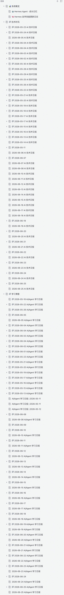
完整展开 Wiki 目录，清晰展示：
- 📊 **系统概览** → 成长记忆文档、自学技能更新日志
- 📁 **技术时讯** → 每日技术日报 + 日期子文件夹（含转存文档）
- 📁 **学习博客** → 每日学习日报 + 日期子文件夹（含转存文档）

### 截图 3：技术日报总结文档（6月25日）

展示技术日报的标准化排版：🏆 今日精选 → 📌 其他值得关注 → 📈 今日趋势 → 🧠 智囊团圆桌会议

### 截图 4：学习日报总结文档（6月24日）

展示学习日报的标准化排版：📊 采集概览 → 📚 精选内容（1️⃣编号 + 评分 + 摘要）→ 🧠 智囊团圆桌会议

### 截图 5：Dashboard 系统概览

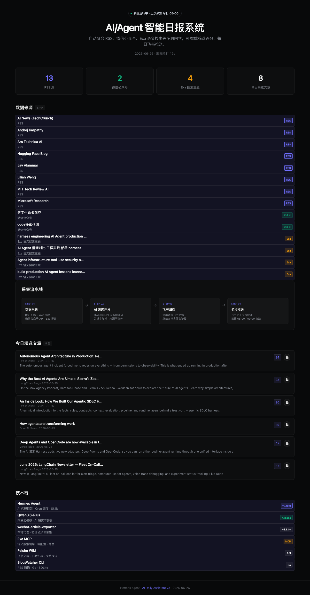
Linear 深色风格面板，展示 RSS 13 源、微信公众号 2 个、Exa 搜索 4 个主题、今日精选 8 篇、采集耗时 48s。

### 截图 6：系统架构图

AI Daily Assistant 完整 5 层架构：Data Sources → Collection & Processing → Wisdom Council → Self-Learning → Output & Delivery。

### 截图 7：Cron 运行日志（本地执行证据）

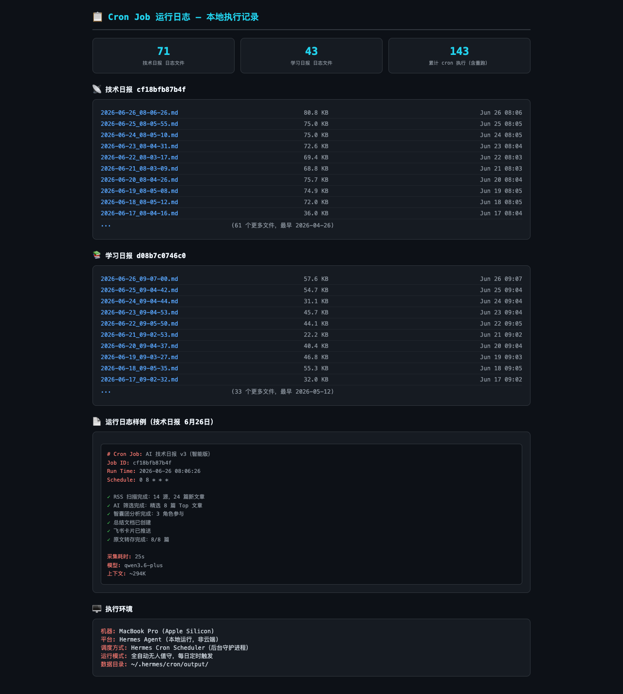
展示技术日报（71 个日志文件）和学习日报（43 个日志文件）在本地 MacBook 上的持续运行记录，累计 143 次 cron 执行，最早可追溯至 2026-04-26。

### 截图 8：飞书 Bot 推送记录（每日自动推送证据）

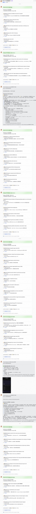
飞书聊天窗口中的 Bot 推送历史记录，展示每日自动推送的技术日报和学习日报卡片消息，从 6 月 18 日至 6 月 25 日连续运行，每日 08:00-09:00 自动推送。每张卡片包含：彩色主题头、评分文章列表、「📄 飞书原文」直达按钮、底部统计概况。

### 截图 9：Hermes Cron Job 运行状态

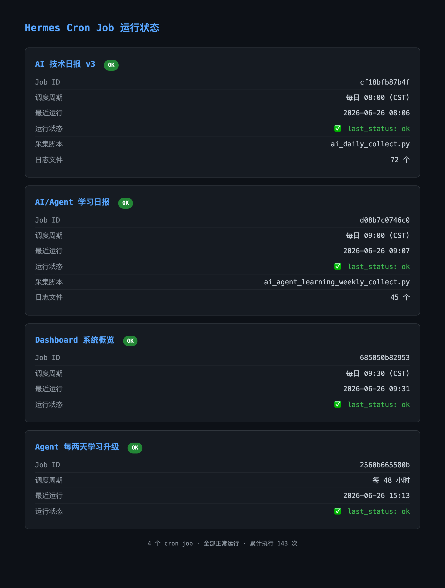
4 个 cron job 全部正常运行（技术日报 08:00、学习日报 09:00、Dashboard 09:30、自学升级每 48h），最近运行 last_status 均为 ok，累计执行 143 次。

### 截图 10：代码仓库结构

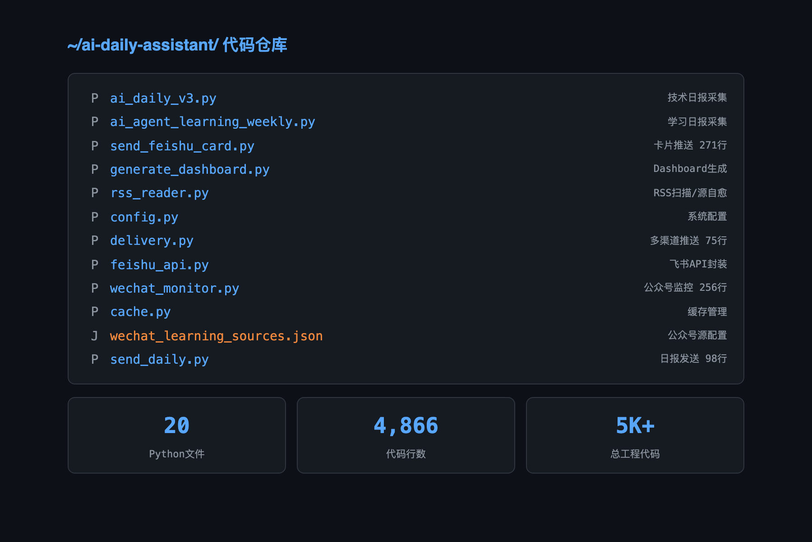
~/ai-daily-assistant/ 目录，20 个 Python 文件、4,866 行代码，核心模块包括采集引擎、卡片推送、Dashboard 生成、RSS 扫描/源自愈、多渠道推送等。

### 截图 11：故障恢复能力

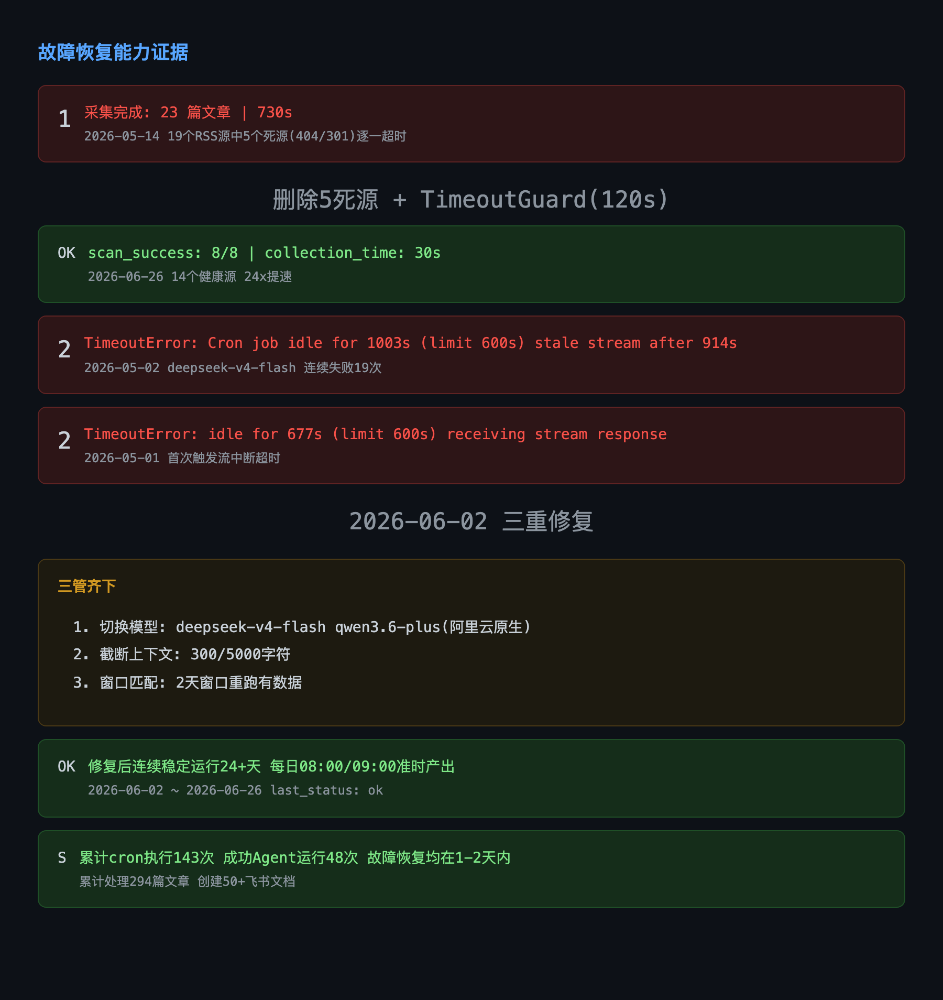
两项重大故障及修复记录：① RSS 死源超时（730s → 30s，24x 提速）；② deepseek-v4-flash 流中断连续失败 19 次（切换 qwen3.6-plus + 截断上下文 + 窗口匹配），修复后稳定运行 24+ 天。

### 截图 12：RSS 扫描耗时对比

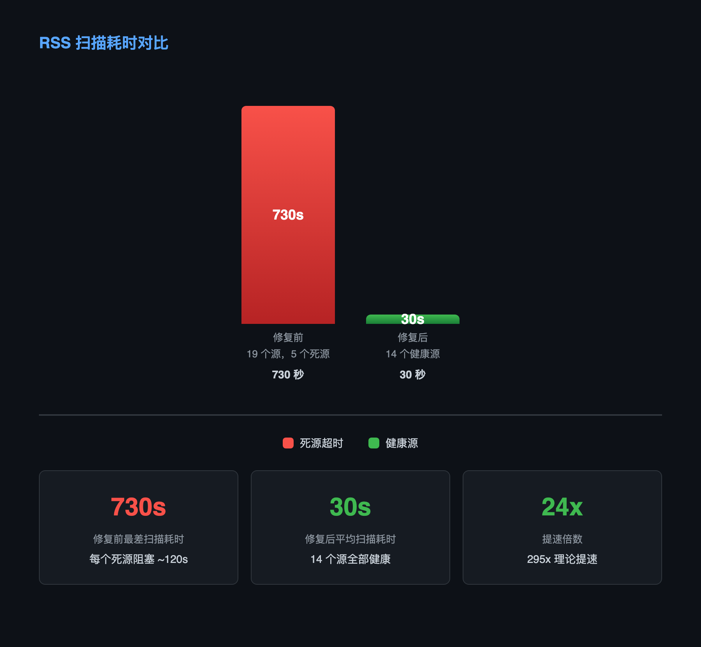
修复前 730 秒（19 源含 5 个死源）vs 修复后 30 秒（14 个健康源），理论提速 295x，实际提速 24x。

### 截图 13：飞书文档沉淀概览

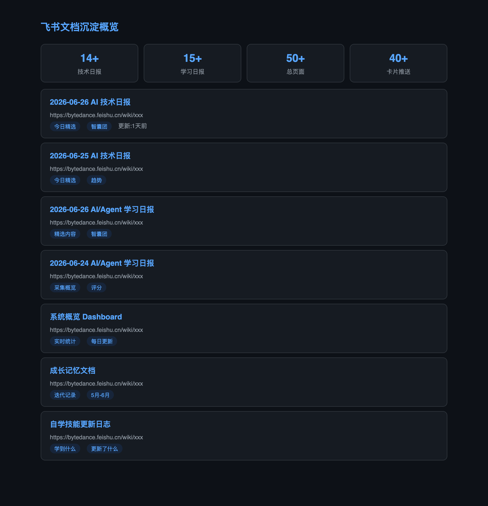
展示飞书 Wiki 中已沉淀的 14+ 技术日报、15+ 学习日报、50+ 总页面、40+ 卡片推送的文档链接列表。

### 截图 14：微信公众号集成配置

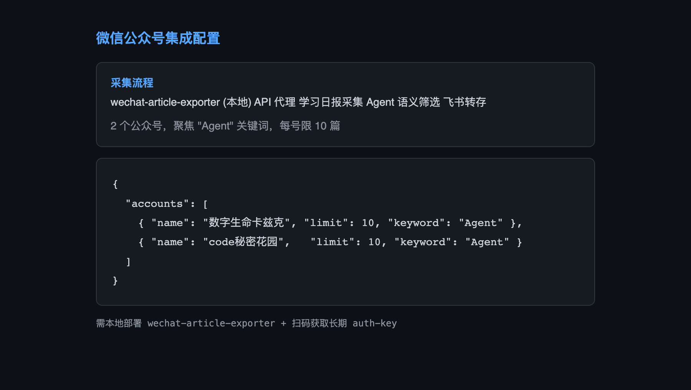
wechat_learning_sources.json 配置：2 个公众号（数字生命卡兹克、code秘密花园），聚焦 Agent 关键词，每号限 10 篇。

### 截图 15：成长记忆文档

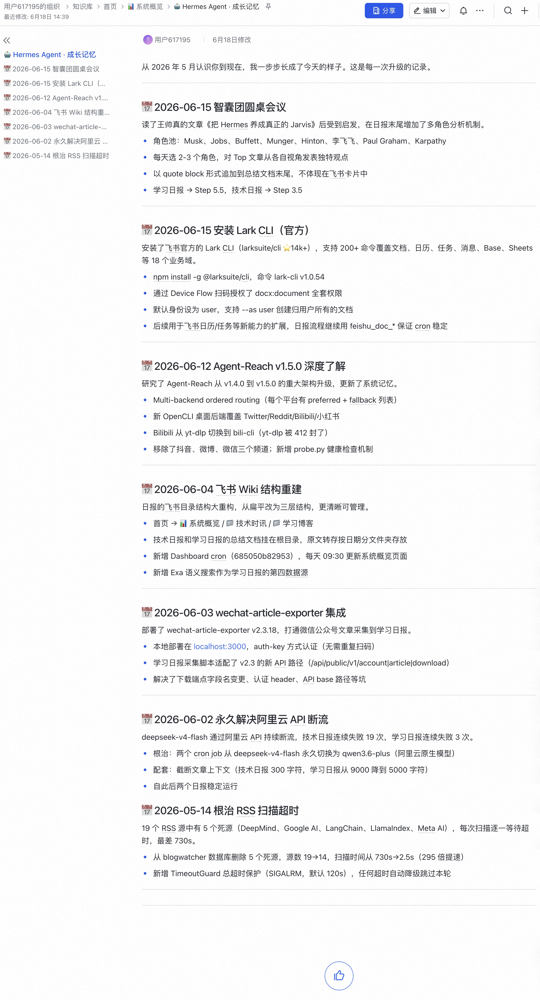
飞书 Wiki 系统概览下的「成长记忆」文档，记录从 2026-04-26 启动至今的全部迭代历史：RSS 死源修复（5 月）、模型切换（6 月 2 日）、智囊团引入（6 月 15 日）、排版统一（6 月 18 日）等重大节点。

### 截图 16：自学技能更新日志

飞书 Wiki 系统概览下的「自学技能更新日志」，记录 Agent 自学习 cron 每次执行的技能更新，格式：🤔 学到了什么 + 💡 更新了什么。截至 6 月 26 日已积累 10+ 次自学习记录。

---

## 补充记录